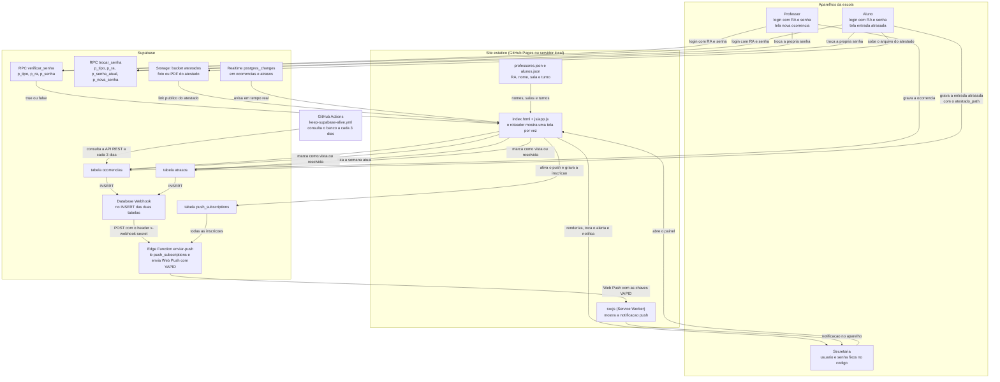

# Fluxo dos dados

Diagrama do caminho que os dados percorrem hoje, montado a partir do próprio
código: `js/app.js`, `js/dados.js`, `js/push.js`, `sw.js` e
`supabase/functions/enviar-push/index.ts`.

## Passo a passo (o que cada seta do diagrama faz)

1. **Login do professor e do aluno** — as telas de login chamam
   `Dados.autenticarProfessor` / `Dados.autenticarAluno`. O RA e a senha vão
   direto para a RPC `verificar_senha` no banco (`true` = senha confere;
   `false` = senha errada; erro técnico = aviso de sistema indisponível). Quando
   a senha confere, o nome, a sala e o turno vêm do `professores.json` /
   `alunos.json` e a sessão é gravada em `sessionStorage`. **A secretaria não
   aparece nesse caminho**: o login dela é conferido no próprio site, contra a
   lista `USUARIOS` de `js/dados.js`.
2. **Troca de senha** — `Dados.trocarSenhaAluno` / `Dados.trocarSenhaProfessor`
   conferem a senha atual com a mesma função do login e, se estiver certa,
   gravam a nova pela RPC `trocar_senha`. Enquanto a gravação não dá certo, a
   senha antiga continua valendo.
3. **Registro da ocorrência (professor)** — `Dados.criarOcorrencia` faz
   `insert` na tabela `ocorrencias` (com `select().single()` para já receber a
   linha criada) e dispara o evento local `ocorrencias:mudou`.
4. **Registro da entrada atrasada (aluno)** — o aluno escolhe a justificativa:
   *"Vim com responsável"* (informa o nome do responsável) ou *"Tenho atestado"*
   (anexa foto ou PDF, obrigatório nesse caso). Só no caminho do atestado o
   arquivo sobe para o bucket `atestados` (`Dados.enviarAtestado`, que devolve o
   caminho do arquivo). Em seguida `Dados.criarEntradaAtrasada` faz `insert` em
   `atrasos`, guardando o caminho em `atestado_path`.
5. **Painel da secretaria** — ao entrar no painel, `iniciarPainel()` abre as duas
   escutas de Realtime e faz o primeiro desenho. `carregarDados()` lê as duas
   tabelas (apenas a semana atual, mais recente primeiro) e `renderizar()`
   redesenha cards, gráficos e tabelas com a mesma "foto" dos dados. Os botões
   "marcar como vista/resolvida" gravam o `status` na tabela correspondente;
   o atestado é aberto pela URL pública do bucket (`verAtestado`).
6. **Realtime → painel** — qualquer `INSERT`, `UPDATE` ou `DELETE` nas tabelas
   `ocorrencias` e `atrasos` cai no callback do canal e chama `renderizar()`. Na
   primeira renderização o painel só registra o que já existe; nas seguintes, um
   id novo faz tocar o alerta sonoro (`Notificacoes.tocarAlerta`) e mostrar uma
   notificação local (`Notificacoes.notificar`, pela permissão do navegador).
7. **Webhook → Edge Function → push** — o mesmo `INSERT` dispara o Database
   Webhook, que chama a Edge Function `enviar-push` enviando o header
   `x-webhook-secret`. A função confere o segredo (`WEBHOOK_SECRET`), escolhe a
   mensagem por `payload.table`, lê **todas** as inscrições de
   `push_subscriptions` com a `SUPABASE_SERVICE_ROLE_KEY` e envia o corpo
   `{ title, body, url }` para cada uma com as chaves VAPID. Inscrições recusadas
   com 404/410 são apagadas da tabela.
8. **Service Worker → secretaria** — o `sw.js` recebe o push e mostra a
   notificação; ao clicar, foca uma aba já aberta ou abre a rota do painel
   (`URL_DESTINO`, definida em `supabase/functions/enviar-push/index.ts`).
9. **Manutenção do banco** — o workflow `keep-supabase-alive.yml` (GitHub
   Actions) consulta `rest/v1/ocorrencias` a cada 3 dias, para o projeto não
   ficar parado.

## Dois avisos diferentes (não confundir)

| | Como chega | De onde vem | Precisa de quê |
| --- | --- | --- | --- |
| Notificação **local** | `Notification` do próprio navegador + beep | `js/app.js` (ao detectar id novo) com `js/notificacoes.js` | painel aberto e permissão de notificação concedida |
| **Push** (aparelho fechado) | Web Push enviado pelo servidor | Edge Function `enviar-push` → `sw.js` | inscrição em `push_subscriptions`, secrets VAPID, webhook e service worker registrado |

## Onde cada parte mora no código

| Parte do fluxo | Arquivo |
| --- | --- |
| Roteador e telas | `js/app.js` (`VIEWS`, `showView`) |
| Login professor / aluno | `js/app.js` + `js/dados.js` (`autenticarProfessor`, `autenticarAluno`) |
| Login secretaria (local) | `js/dados.js` (`autenticarSecretaria`, lista `USUARIOS`) |
| Senhas (RPC) | `js/dados.js` (`verificar_senha`, `trocar_senha`) |
| Ocorrências (tabela) | `js/dados.js` (`criarOcorrencia`, `listarOcorrencias`, `atualizarStatus`) |
| Entradas atrasadas (tabela) | `js/dados.js` (`criarEntradaAtrasada`, `listarEntradasAtrasadas`, `atualizarStatusEntradaAtrasada`) |
| Atestado (Storage) | `js/dados.js` (`enviarAtestado`, `deLinhaAtraso` com `getPublicUrl`) |
| Tempo real | `js/dados.js` (`aoMudar`, `aoMudarEntradasAtrasadas`) + `js/app.js` (`iniciarPainel`, `pararPainel`) |
| Inscrição do push no navegador | `js/push.js` (`ativarPush`) |
| Notificação local (navegador) | `js/notificacoes.js` + `sw.js` |
| Envio do push (servidor) | `supabase/functions/enviar-push/index.ts` |
| Manter o banco ativo | `.github/workflows/keep-supabase-alive.yml` |

## Regras que valem em todo o fluxo

- **Semana atual**: ocorrências e entradas atrasadas só são lidas de
  segunda-feira 00:00 até agora (`inicioDaSemana()` em `js/dados.js`). O que é de
  semanas anteriores continua no banco, mas não passa pelo site.
- **Sessão**: guardada em `sessionStorage` e conferida pelos `guard` do
  `js/app.js`; fechar o navegador encerra a sessão.
- **Quando o Supabase não responde** (projeto pausado, sem internet, erro 5xx),
  as telas mostram *"Sistema temporariamente indisponível. Avise a secretaria ou
  tente novamente em alguns minutos."* e o erro técnico fica no console — senha
  errada continua sendo tratada como senha errada.
- **Nada do Supabase Auth é usado** (`supabase.auth` não aparece no código); o
  SDK é usado só para `rpc`, tabelas (`from`), `storage` e canais de Realtime.
